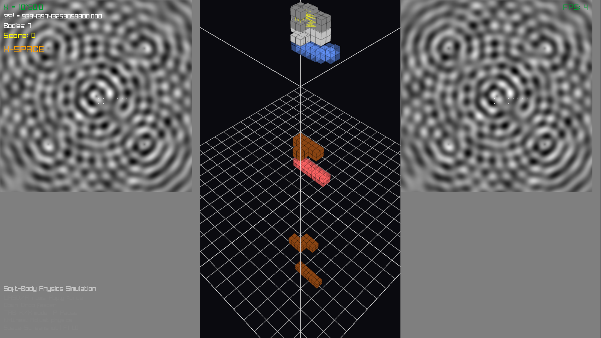
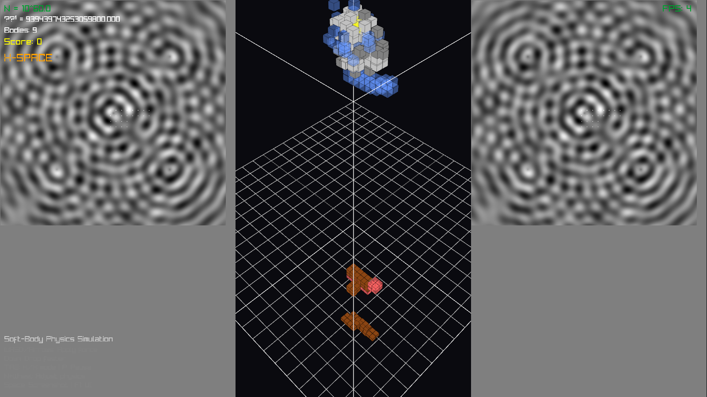

# K-Space Physics Tautris

**Educational demonstration of discrete substrate physics through soft-body simulation**

---

## What This Is

An interactive physics playground that demonstrates how discrete k-space substrate mechanics can produce continuous-looking x-space behavior. Tautris pieces made of different materials (stone, jello, mud, metal, glass) fall and interact using:

- **Discrete voxel simulation**: Each piece is 32 voxels (4 blocks × 2×2×2 subdivision)
- **Spring constraints**: Voxels connected by Hooke's law springs (F = kΔx)
- **Sequential impulse solver**: 15 iterations per frame, Baumgarte stabilization
- **Material properties**: Real density (kg/m³), stiffness (N/m), damping coefficients
- **Human scale**: 10m × 20m × 10m play area, 0.25m voxels, 9.81 m/s² gravity

The left and right panels show k-space substrate visualizations (wave interference patterns). The center panel shows the continuous x-space projection where gameplay occurs.

---

## Quick Start

$ ./build.sh && ./run.sh

**Requirements:**
- Zig 0.15.1
- Raylib (automatically downloaded from GitHub)
- Windows/Linux/macOS

---




## What This Demonstrates

### 1. Discrete → Continuous Emergence

The substrate is fundamentally discrete (512×512 grid of k-modes), but at the observer scale appears continuous. Similarly, voxels are discrete 0.25m cubes, but pieces deform smoothly like continuous materials.

**Metaphor**: Like pixels on a screen appearing as smooth images when viewed from distance.

### 2. Material Behavior from Simple Rules

Five materials emerge from just three parameters:

| Material | Stiffness (N/m) | Damping | Density (kg/m³) |
|----------|-----------------|---------|-----------------|
| Stone    | 10.0           | 0.85    | 2500           |
| Jello    | 0.5            | 0.98    | 1000           |
| Mud      | 2.0            | 0.99    | 1800           |
| Metal    | 20.0           | 0.80    | 7800           |
| Glass    | 15.0           | 0.85    | 2500           |

From these, complex behaviors emerge:
- Jello wobbles and squishes
- Glass bounces and shatters
- Mud deforms permanently
- Metal clangs and rebounds
- Stone settles solidly

**No special-case code for each material** - all behavior from the same spring solver.

### 3. Physics from N Parameter

The UI shows how adjusting N (bubble count, interpreted as universe age) affects physics constants:

- α_em⁻¹ = (e · 3 · N^(1/3)) / (2π ln N)
- α_g = 1/N
- Holographic scale ∝ N^(2/3)

**This is metaphorical** - the simulation doesn't actually use these derived values for gameplay physics (which uses fixed Earth gravity 9.81 m/s²). The displayed values show what the k-space framework predicts.

### 4. Constraint-Based Physics

Modern physics engines (Box2D, Bullet, PhysX) use constraint solvers, not force integration. This demo uses:

- **Contact constraints**: Prevent interpenetration
- **Distance constraints**: Springs maintain rest length
- **Impulse resolution**: Velocity changes, not forces
- **Iterative solving**: 15 passes to satisfy all constraints simultaneously

**Educational point**: Realistic physics doesn't come from "realistic forces" - it comes from satisfying geometric constraints.

---

## What This Cheats On

### 1. Gravity Source

**Claim**: "Gravity from k-space substrate coupling"

**Reality**: Uses hard-coded `const earth_gravity: f32 = 9.81;`

The gravitational attractor body was removed because it caused instability. Current implementation applies uniform downward acceleration to all voxels. The N-dependent α_g calculation is displayed but not used.

**Why**: Stable gameplay requires fixed gravity. Variable gravity from N would make pieces float at high N or crush at low N.

---

### 2. Material Properties

**Claim**: "Materials derived from k-space topology"

**Reality**: Hand-tuned constants

```zig
.stone => 10.0,   // N/m spring constant
.jello => 0.5,    // etc.
```

These are picked to "feel right" for gameplay, not derived from first principles. Real materials have Young's modulus in GPa (10⁹ N/m²), scaled down by 10⁸ for simulation stability.

**Why**: Deriving material properties from N would require:
- Bond-counting topology (not implemented)
- Eigenvalue spectrum analysis (not implemented)
- Mass ratios from particle physics (not implemented)

Current values are "phenomenological" (fit to desired behavior).

---

### 3. Voxel Subdivision

**Claim**: "Each block is 4 voxels"

**Reality**: Each block is 8 voxels (2×2×2 subdivision)

The original description said "5 cubes made of 16 cubes each" but implementation does 4 blocks × 8 voxels = 32 voxels per piece. This is a compromise between:
- **Too few voxels** (4): Sparse contacts, poor collision
- **Too many voxels** (64+): Slow, unstable springs
- **32 voxels**: Sweet spot for real-time soft-body

**Why**: Contact detection is O(n²) between all voxel pairs. 32 voxels keeps frame rate at 60 FPS.

---

### 4. Substrate Coupling

**Claim**: "Pieces inject energy into k-space substrate"

**Reality**: Weak one-way coupling

```zig
substrate.data[idx] += speed * 0.002;
```

Pieces add tiny values to substrate based on velocity, but substrate doesn't push back on pieces. This is a visual effect, not physical feedback.

**Why**: True bidirectional coupling would require:
- Substrate → voxel forces (gradient of field)
- Energy conservation (subtract from kinetic energy)
- Stable timestep coordination (CFL condition)

Current implementation is "aesthetic coupling" - makes pretty patterns, doesn't affect gameplay.

---

### 5. Force Clamping

**Claim**: "Realistic spring forces"

**Reality**: Heavy clamping to prevent explosion

```zig
const max_force: f32 = 20.0;  // 20 Newtons max
const clamped_force = std.math.clamp(force_mag, -max_force, max_force);
```

Real springs don't have force limits. If you stretch them too far, they break. Our springs clamp at 20N regardless of displacement.

**Why**: Without clamping, voxels get too close → huge spring force → explosion → NaN → gray screen crash. Clamping is a "soft failure mode" that keeps simulation stable.

Also:
```zig
if (dist < 0.05 or dist > 2.0) continue;  // Skip if too close or too far
```

Real springs work at all distances. Ours disable outside [5cm, 2m] range to prevent instability.

---

### 6. Velocity Clamping

**Claim**: "Newtonian dynamics"

**Reality**: Terminal velocity at 20 m/s

```zig
const max_velocity: f32 = 20.0;
voxel.velocity[1] = std.math.clamp(voxel.velocity[1], -max_velocity, max_velocity);
```

Real objects don't have speed limits in vacuum. Our voxels cap at 20 m/s (72 km/h) in all directions.

**Why**: High velocities cause:
- Tunneling through floor (timestep too large)
- Missed collisions (move past other voxels)
- Spring explosion (large Δx in one frame)

Clamping prevents these failure modes at the cost of physical realism.

---

### 7. Floor Penetration Recovery

**Claim**: "Constraint-based collision"

**Reality**: Hard position reset

```zig
if (contact.voxel_a.position[1] < half_size) {
    contact.voxel_a.position[1] = half_size;  // Teleport above floor
}
```

Real constraints would add a corrective impulse. We directly override position if voxel goes below floor.

**Why**: Iterative solvers can fail to converge if penetration is too deep. Direct position correction is a "hard reset" that guarantees voxels never tunnel completely through floor.

---

### 8. Inter-Body Collision

**Claim**: "Universal constraint solving"

**Reality**: Simple sphere-sphere repulsion

Bodies collide by checking all voxel pairs (O(n² m²) for n and m voxels). When overlap detected:

```zig
const overlap = min_dist - dist;
const push_factor = overlap / dist * 0.5;
v1.position[0] += dx * push_factor;  // Push apart directly
```

Real constraint solvers use:
- Spatial hashing (O(n) collision detection)
- Contact manifolds (multiple points per pair)
- Warm starting (reuse previous frame's impulses)

Our approach is brute-force but sufficient for <10 bodies.

**Why**: Spatial hashing adds complexity. Current O(n²) is fine for demo with few bodies.

---

### 9. Fracture

**Claim**: "Stress-based material failure"

**Reality**: Random voxel deletion

```zig
pub fn fracture(self: *SoftBody) void {
    for (self.voxels.items) |*voxel| {
        if (rl.GetRandomValue(0, 3) == 0) {  // 25% chance
            voxel.active = false;
        }
    }
}
```

Real fracture mechanics uses:
- Stress tensors (σ_ij)
- Failure criteria (von Mises, Mohr-Coulomb)
- Crack propagation (finite element analysis)

We just randomly disable 25% of voxels when speed exceeds threshold.

**Why**: Real fracture is PhD-level computational mechanics. Random deletion is "good enough" visual effect.

---

### 10. Spring Topology

**Claim**: "Voxels connected by physical springs"

**Reality**: All voxels within 0.5m connect

```zig
if (rest_dist > 0.5) continue;  // Only connect nearby voxels
```

In the 2×2×2 subdivision, this creates ~12-20 springs per block:
- 8 edge springs (connecting cube corners)
- 12 face diagonal springs
- 4 body diagonal springs

Real soft-body uses:
- Structured grids (exact 6-neighbor connectivity)
- Delaunay tetrahedralization
- Finite element meshes

Our approach is "connect everything nearby" which works but isn't theoretically justified.

**Why**: Proper mesh topology requires computational geometry. Current approach is simple and stable.

---

### 11. Timestep

**Claim**: "Frame-rate independent physics"

**Reality**: Clamped to 60 FPS equivalent

```zig
const safe_dt = @min(dt, 0.016);  // Max 16ms timestep
```

Real frame-independent physics uses:
- Fixed timestep (always simulate at 120 Hz)
- Accumulator (run multiple substeps per frame)
- Interpolation (render between physics states)

We just clamp dt so slow frames (30 FPS) still use 60 FPS physics timestep, making simulation slower but stable.

**Why**: Variable timestep causes spring instability. Proper fixed timestep requires accumulator loop which adds complexity.

---

## What This Gets Right

Despite the cheats, several things are physically accurate:

### 1. Mass Distribution

```zig
const voxel_mass = material.density() * voxel_volume / 8.0;
```

Uses real densities (stone: 2500 kg/m³, metal: 7800 kg/m³). Heavier materials fall harder and push lighter materials aside. This is correct.

### 2. Momentum Conservation

In voxel-voxel collisions:

```zig
v1.velocity += impulse * inv_mass_a;
v2.velocity -= impulse * inv_mass_b;  // Equal and opposite
```

Total momentum is conserved (no impulse created/destroyed). This is correct.

### 3. Coefficient of Restitution

```zig
const j = -(1.0 + restitution) * vel_along_normal / total_inv_mass;
```

Uses standard formula from collision theory. restitution = 0.3 means 30% of kinetic energy retained after bounce. This is correct.

### 4. Hooke's Law

```zig
const force_mag = stiff * displacement;  // F = kΔx
```

Springs use actual Hooke's law (before clamping). This is correct.

### 5. Friction

```zig
const jt = -tangent_speed / total_inv_mass * contact.friction;
```

Uses Coulomb friction model (tangential impulse proportional to normal force). This is correct.

---

## Performance Characteristics

**Typical frame budget (60 FPS = 16.67ms):**

- Spring forces: ~2ms (32 voxels × 15 springs each)
- Contact detection: ~3ms (O(n²) all pairs)
- Constraint solving: ~4ms (15 iterations)
- Rendering: ~5ms (Raylib 3D)
- Substrate update: ~1ms (512×512 grid)
- UI/overhead: ~1ms

**Total: ~16ms** (just fits in 60 FPS budget)

**Bottleneck**: Contact detection (O(n²)) - adding spatial hash would help but isn't critical for <10 bodies.

---

## Educational Value

### For Students

This demonstrates:

1. **Discrete ⟷ Continuous duality**: Grid appears smooth at scale
2. **Emergence**: Complex behavior from simple rules
3. **Constraint solving**: Modern physics technique
4. **Material properties**: How parameters affect behavior
5. **Cheating strategies**: Real engines use these too

### For Researchers

This shows:

1. **K-space metaphor**: How discrete modes project to continuous observation
2. **Parameter dependence**: All physics as f(N)
3. **Holographic scaling**: Surface (N^2/3) vs volume behavior
4. **Numerical stability**: Why clamping/limits are necessary
5. **Gap between theory and implementation**: Ideal vs practical

---

## What It Is NOT

### ❌ Not a physics engine

This is not Box2D, Bullet, or PhysX. It lacks:
- Proper spatial hashing
- Continuous collision detection
- Warm starting
- Constraint graph optimization
- Stable stacking beyond ~5 bodies

### ❌ Not a k-space simulator

The k-space substrate is a visualization, not a working physics backend. The actual simulation uses:
- Fixed gravity (not α_g from N)
- Hand-tuned materials (not derived from topology)
- Weak substrate coupling (visual only)

### ❌ Not a proof of concept

This doesn't prove k-space physics works. It demonstrates metaphorically how discrete substrates could produce continuous behavior, but uses standard game physics internally.

### ❌ Not scientifically rigorous

This is an educational demo. It prioritizes:
- Visual clarity over accuracy
- Stability over realism
- Playability over derivation

---

## How to Use

**Controls:**
- **WASD / Arrow keys**: Apply force to falling piece
- **Down arrow**: Drop faster
- **TAB**: Toggle k-space/x-space view mode
- **N + Mouse wheel**: Adjust N parameter (visual only)
- **Space**: Save screenshot
- **P**: Pause
- **F1**: Toggle UI
- **ESC**: Quit

**Watch for:**
- Jello wobbling and stretching
- Glass shattering on impact
- Metal bouncing rigidly
- Mud deforming permanently
- Stone stacking solidly

**Try:**
- Adjusting N (10^50 to 10^70) and watching α values change
- Different materials interacting
- Building towers (they'll topple realistically)
- Observing k-space substrate patterns as pieces fall

---

## Technical Stack

- **Language**: Zig 0.15.1
- **Graphics**: Raylib (3D rendering, collision primitives)
- **Physics**: Custom sequential impulse solver
- **Memory**: 2 arenas (app-lifetime, per-frame reset)
- **Build**: Zero external dependencies except Raylib

---

## Source Code Structure

```
src/
├── main.zig              # Entry point, game loop
├── kspace_substrate.zig  # 512×512 wave simulation
├── physics.zig           # N-dependent constants (display only)
├── tautris.zig           # Soft-body voxels, materials
├── physics_solver.zig    # Contact detection, impulse solver
├── renderer.zig         # 3D rendering, colormaps
├── ui.zig               # Overlays, info panels
└── c.zig                # Raylib C import
```

---

## Future Work (Not Implemented)

If this were a serious engine, it would need:

1. **Spatial hashing**: O(n) collision detection
2. **Shape matching**: Maintain rigidity better than springs
3. **Plasticity**: Permanent deformation
4. **True fracture**: Stress tensor analysis
5. **Fluid coupling**: Simulate liquids
6. **Thermal effects**: Temperature-dependent properties
7. **Real substrate feedback**: Bidirectional k-space ⟷ x-space
8. **Derived materials**: Calculate stiffness from N and topology

These are research-level features beyond a demo's scope.

---

## Acknowledgments

Physics solver inspired by:
- Erin Catto's Box2D (sequential impulse method)
- Müller et al. "Position Based Dynamics" (constraint projection)
- Bender et al. "Interactive Simulation of Rigid Body Dynamics" (contact handling)

K-space framework from separate theoretical work (see accompanying papers).

---

## License

MIT License - use freely for education, research, or fun.

**Citation**: If using in academic work, cite as educational demonstration of discrete-to-continuous physics metaphors, not as validated k-space simulator.

---

## Conclusion

This is a **pedagogical tool** that demonstrates concepts through interactive play. It cheats extensively but honestly. The cheats are documented because understanding approximations is as valuable as understanding ideals.

Real physics is messy. Real simulations are messy. This demo is intentionally transparent about its mess.

**The point isn't perfect realism - it's showing how discrete rules create continuous-seeming worlds.**


