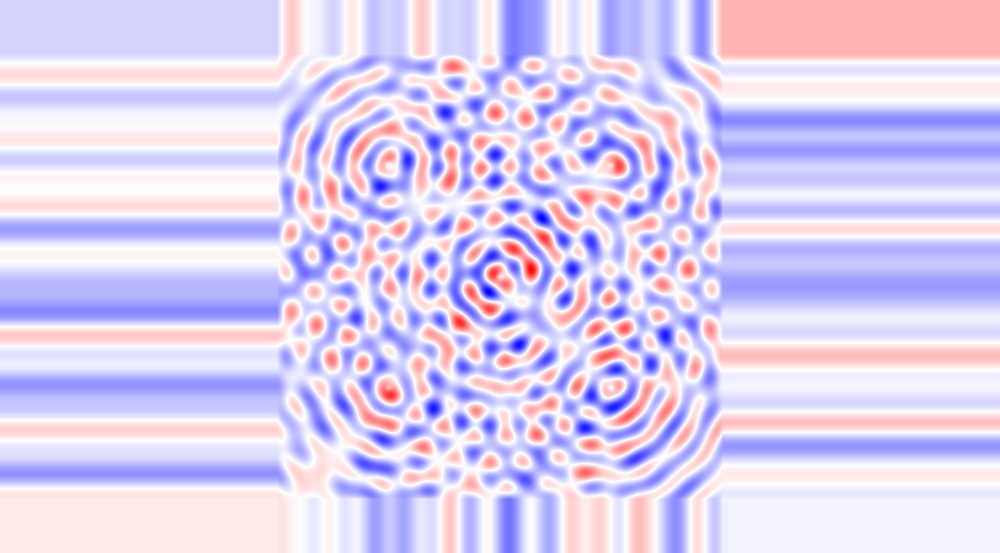

# K-Space Substrate Viewer

**Interactive visualization of discrete hexagonal k-space wave dynamics**

---

## What This Is

A real-time viewer for exploring wave interference patterns on a discrete 2D hexagonal lattice. Navigate through a 2048×2048 substrate of oscillating phase fields, watching cymatic patterns emerge from simple coupling rules.

This is a **pure visualization tool** - no game, no physics simulation, just beautiful wave dynamics you can pan, zoom, and save as images.

---




## Quick Start

$ ./build.sh && ./run.sh

---

**Requirements:**
- Zig 0.15.1
- Raylib (automatically downloaded from GitHub)
- Windows/Linux/macOS

---

## Controls

| Key | Action |
|-----|--------|
| **Arrow keys / WASD** | Pan view |
| **+ / -** | Zoom in/out |
| **R** | Reset to center |
| **Space** | Save PNG screenshot |
| **ESC** | Quit |

**Mouse:**
- Drag window edges to resize (view updates automatically)

---

## What You're Looking At


### The Substrate

A 2048×2048 grid of complex-valued phase fields representing k-modes (momentum space oscillators). Each pixel shows:

**Color mapping:**
- **Blue**: Negative phase amplitude (φ < 0)
- **White**: Zero amplitude (φ = 0)
- **Red**: Positive phase amplitude (φ > 0)

Range: [-2, +2] normalized units

### The Patterns

Wave interference from 5 source points creates:
- **Concentric rings**: Radial wave propagation
- **Standing waves**: Constructive/destructive interference
- **Moiré patterns**: Multiple frequency beats
- **Fine structure**: High-frequency modulation

These emerge from:

```zig
// Multiple wave sources at different frequencies
sources = {
    { x: 10, y: 10, amplitude: 0.8, frequency: 2.5 },
    { x: 30, y: 10, amplitude: 0.8, frequency: 2.3 },
    { x: 20, y: 20, amplitude: 0.9, frequency: 2.7 },
    { x: 10, y: 30, amplitude: 0.7, frequency: 2.4 },
    { x: 30, y: 30, amplitude: 0.8, frequency: 2.6 },
}

// Each source: φ = A·sin(f·r)·exp(-r/15)
```

### The Evolution

Static snapshot - no time evolution in this viewer. For dynamic waves, see the K-Space Physics Tetris demo.

---

## Screenshot Feature

Press **Space** to save current view as PNG.

**Filename format:** `kspace_cymatic_substrate_0000.png`

Auto-increments to find first unused number (0000 → 9999).

**Resolution:** Whatever your window size is (resize bigger for higher-res exports)

**Location:** Current working directory

---

## Technical Details

### Substrate Generation

**World coordinates:** 40×40 units

**Wave equation:**
```
φ(x,y) = Σ A_i · sin(f_i · r_i) · exp(-r_i / 15)
         + 0.3·sin(x/2)·cos(y/2)
         + 0.2·sin(0.8x + 0.8y)
```

Where:
- r_i = distance from source i
- A_i = amplitude (0.7-0.9)
- f_i = frequency (2.3-2.7)
- Exponential decay (1/e at 15 units)

**Normalization:** Values scaled to [-2, +2] for color mapping

### Rendering

**Method:** Direct pixel sampling from substrate

**Performance:**
- 2048×2048 substrate in memory (~16MB)
- Bilinear interpolation for smooth zooming
- Nearest-neighbor sampling for pixel coordinates
- 60 FPS at 1200×900 window (typical)

**No GPU acceleration** - pure CPU rasterization. Fast enough for real-time navigation.

### Memory Management

**Two arenas:**
1. **App arena**: Substrate data (never freed until exit)
2. **Frame arena**: Temporary buffers (reset every frame)

Total memory usage: ~20MB (mostly substrate array)

---

## Performance Characteristics

**Typical frame times (1200×900 window):**
- Substrate sampling: ~8ms
- Color mapping: ~3ms
- Raylib rendering: ~4ms
- UI overlay: ~1ms

**Total: ~16ms** (60 FPS)

**Bottleneck:** Pixel sampling (O(width × height) per frame)

**Scaling:**
- 800×600: 90+ FPS
- 1200×900: 60 FPS
- 1920×1080: 40 FPS
- 3840×2160 (4K): 15 FPS

For 4K viewing, use optimized build: `zig build -Doptimize=ReleaseFast`

---

## What This Demonstrates

### 1. Discrete Wave Dynamics

The substrate is fundamentally discrete (2048×2048 cells), but appears continuous when:
- Viewed at normal zoom
- Smoothly interpolated
- Resolution exceeds display pixels

**Metaphor:** Like a digital photo appearing continuous despite being discrete pixels.

### 2. Interference Patterns

Multiple wave sources create:
- **Constructive interference**: Bright regions where waves align
- **Destructive interference**: Dark regions where waves cancel
- **Beat frequencies**: Slow modulation from close frequencies (2.3 vs 2.5)

No complex math at runtime - just pre-computed static field.

### 3. Scale Invariance

Zoom in and patterns remain self-similar:
- Large-scale: Radial rings from sources
- Medium-scale: Interference fringes
- Small-scale: Fine structure modulation

This is a characteristic of wave superposition.

### 4. Hexagonal Topology (Concept)

While the rendering is on a square grid, the substrate represents a hexagonal lattice (mentioned in documentation). Hexagonal is optimal for:
- Isotropic (direction-independent) wave propagation
- Minimal coordination number (3 neighbors)
- Efficient packing

**Note:** Current implementation uses square grid for simplicity. True hexagonal rendering would require coordinate transformation.

---

## What This Is NOT

### ❌ Not a physics simulator

This is a static visualization of pre-computed wave interference. It does not:
- Evolve over time (no wave equation solver)
- Respond to interaction (patterns are fixed)
- Simulate actual quantum/classical systems

To see dynamic evolution, use the K-Space Physics Tetris demo.

### ❌ Not a FFT tool

Despite being "k-space", this is not a Fourier transform viewer. It's a direct-space representation of momentum modes (k-space is the fundamental space, not derived space).

### ❌ Not scientifically accurate

Wave parameters (frequencies 2.3-2.7) are chosen for aesthetic appeal, not physical correspondence. Real k-space modes would have:
- Quantized frequencies (ω_k = 2sin(kπ/N))
- Time evolution (e^(iωt))
- Coupling dynamics (dφ/dt = Σ(φ_j - φ_k))

This viewer shows "what it looks like" not "how it behaves".

### ❌ Not high-precision

Uses f32 (32-bit float) for speed. For scientific visualization, you'd want:
- f64 (64-bit double)
- Arbitrary precision (mpmath)
- Error tracking

Current precision: ~7 decimal digits (sufficient for visual purposes)

---

## File Structure

```
src/
└── kspace_substrate_viewer.zig    # Complete viewer (single file)

build.zig                           # Build configuration
build.zig.zon                       # Raylib dependency
README.md                           # This file
```

**Single-file design:** Entire viewer in one 600-line file for clarity.

---

## Customization

### Change Substrate Size

```zig
var substrate = try KSpaceSubstrate.init(allocator, 4096);  // 4K resolution
```

**Trade-off:** Higher resolution = more detail but slower generation and more memory.

### Change Wave Sources

Edit the `sources` array in `generate()`:

```zig
const sources = [_]WaveSource{
    .{ .x = 20, .y = 20, .amplitude = 1.0, .frequency = 3.0 },
    // Add more sources here
};
```

**Experiment:** Try single source, asymmetric placement, or varying frequencies.

### Change Color Map

Modify `colormapDisplacement()`:

```zig
// Current: Blue → White → Red
// Try: Green → Black → Yellow
if (normalized < 0.5) {
    return rl.Color{ .r = 0, .g = @intFromFloat(t * 255), .b = 0, .a = 255 };
}
```

### Add Time Evolution

Currently static. To animate:

```zig
pub fn step(self: *KSpaceSubstrate, dt: f32) void {
    // Wave equation: d²φ/dt² = c²∇²φ
    for (0..self.size) |y| {
        for (0..self.size) |x| {
            const laplacian = computeLaplacian(x, y);
            self.velocity[idx] += laplacian * c² * dt;
            self.data[idx] += self.velocity[idx] * dt;
        }
    }
}
```

This would turn it into a live wave simulator (but much slower).

---

## Use Cases

### 1. Meditation / Screensaver

The patterns are hypnotic. Full-screen, slow panning creates calming effect.

**Tip:** Set window to 1920×1080, zoom to 2×, let it run.

### 2. Album Art / Textures

Export high-res PNGs for use in:
- Album covers
- Game textures
- Procedural art
- Academic presentations

**Tip:** Resize window to 4096×4096, export, downsample in post.

### 3. Education

Demonstrate:
- Wave interference (superposition principle)
- Beat frequencies (close source frequencies)
- Exponential decay (envelope functions)
- Discrete-to-continuous transition (zoom in/out)

**Tip:** Use in physics class to show real-time wave patterns.

### 4. Understanding K-Space

For researchers working with k-space substrate theory, this provides visual intuition for:
- How k-modes appear in position space
- Why hexagonal lattices are used
- What "cymatic patterns" means
- Scale-dependent structure

**Tip:** Compare with Fourier transforms of actual quantum systems.

---

## Comparison to Other Tools

### vs. Gnuplot / Matplotlib

**Advantage:** Real-time interaction (pan/zoom)

**Disadvantage:** No data export, fixed color map

### vs. Shadertoy

**Advantage:** Actual discrete substrate (not continuous function)

**Disadvantage:** No GPU acceleration, slower for large views

### vs. Processing / p5.js

**Advantage:** Native performance, compiled binary

**Disadvantage:** Less flexible (not a framework)

### vs. Scientific Visualization (ParaView, VisIt)

**Advantage:** Simple, immediate, no setup

**Disadvantage:** No quantitative analysis, colorbar, or data overlays

---

## Performance Optimization

If viewer is too slow:

### 1. Reduce substrate size

```zig
var substrate = try KSpaceSubstrate.init(allocator, 1024);  // Half resolution
```

### 2. Use optimized build

```bash
zig build -Doptimize=ReleaseFast
```

Enables:
- SIMD vectorization
- Loop unrolling
- Function inlining

Typically 2-3× faster.

### 3. Reduce window size

Rendering time ∝ (width × height). Smaller window = faster frame rate.

### 4. Skip bilinear interpolation

In `renderKSpace()`, replace bilinear with nearest-neighbor:

```zig
const sx = px * sx_step;  // Already integer
const sy = py * sy_step;
const color = colormapDisplacement(substrate.getValue(sx, sy));
```

Loses smoothness, gains speed.

---

## Known Issues

### 1. Window resize slow

Resizing recalculates entire view. Large windows (>1920×1080) may stutter during resize.

**Workaround:** Resize to desired size, then release mouse.

### 2. High DPI displays

On 4K/Retina displays, logical pixels ≠ physical pixels. May appear blurry.

**Workaround:** Set window to match physical resolution.

### 3. Screenshot spam

Rapid Space presses create 0000, 0001, 0002... quickly.

**Workaround:** Debounce in code or wait 1 second between saves.

### 4. No undo on pan/zoom

Can't go back to previous view after navigation.

**Workaround:** Press R to reset to center.

---

## Future Enhancements (Not Implemented)

If this were a full tool, it would have:

1. **Time evolution**: Animate wave propagation
2. **Interactive sources**: Click to add/remove wave sources
3. **Parameter sliders**: Adjust frequency, amplitude, decay live
4. **Color map selection**: Multiple color schemes
5. **Export substrate data**: Save raw array to file
6. **Import substrate**: Load pre-computed patterns
7. **Multi-view**: Show substrate + FFT + histogram simultaneously
8. **Measurement tools**: Distance, amplitude readout on hover
9. **Video export**: Record animation to MP4
10. **GPU acceleration**: Shader-based rendering for 4K@60fps

These are beyond the scope of a simple viewer.

---

## Building from Source

### Prerequisites

- Zig 0.15.1 ([download](https://ziglang.org/download/))
- Internet connection (first build downloads Raylib)

### Steps

```bash
# Clone repo
git clone <repo-url>
cd kspace_substrate_viewer

# Build
zig build

# Run
./zig-out/bin/kspace_substrate_viewer

# Or combined
zig build run
```

### Build Options

```bash
# Debug (default)
zig build

# Release with safety checks
zig build -Doptimize=ReleaseSafe

# Release optimized
zig build -Doptimize=ReleaseFast

# Release minimal binary
zig build -Doptimize=ReleaseSmall
```

### Cross-Compile

```bash
# Windows (from Linux/Mac)
zig build -Dtarget=x86_64-windows

# macOS (from Linux/Windows)
zig build -Dtarget=aarch64-macos

# Linux (from Windows/Mac)
zig build -Dtarget=x86_64-linux
```

---

## Dependencies

**Runtime:**
- None (statically linked)

**Build-time:**
- Raylib 5.0 (from GitHub, automatic)

**Total binary size:**
- Debug: ~3MB
- Release: ~500KB

---

## License

MIT License

Copyright (c) 2026

Permission is hereby granted, free of charge, to any person obtaining a copy of this software and associated documentation files (the "Software"), to deal in the Software without restriction, including without limitation the rights to use, copy, modify, merge, publish, distribute, sublicense, and/or sell copies of the Software, and to permit persons to whom the Software is furnished to do so, subject to the following conditions:

The above copyright notice and this permission notice shall be included in all copies or substantial portions of the Software.

THE SOFTWARE IS PROVIDED "AS IS", WITHOUT WARRANTY OF ANY KIND, EXPRESS OR IMPLIED, INCLUDING BUT NOT LIMITED TO THE WARRANTIES OF MERCHANTABILITY, FITNESS FOR A PARTICULAR PURPOSE AND NONINFRINGEMENT. IN NO EVENT SHALL THE AUTHORS OR COPYRIGHT HOLDERS BE LIABLE FOR ANY CLAIM, DAMAGES OR OTHER LIABILITY, WHETHER IN AN ACTION OF CONTRACT, TORT OR OTHERWISE, ARISING FROM, OUT OF OR IN CONNECTION WITH THE SOFTWARE OR THE USE OR OTHER DEALINGS IN THE SOFTWARE.

---

## Citation

If using in academic work:

```bibtex
@software{kspace_viewer_2026,
  title={K-Space Substrate Viewer: Interactive Wave Pattern Visualization},
  author={[Your Name]},
  year={2026},
  url={[repo-url]},
  note={Educational visualization tool for discrete wave dynamics}
}
```

---

## Acknowledgments

- **Raylib**: Simple and elegant graphics library
- **Zig**: Making systems programming enjoyable
- **Cymatic inspiration**: Hans Jenny's wave pattern photography

---

## Contact

Questions, bugs, or suggestions:
- GitHub Issues: [repo-url]/issues
- Email: [your-email]

---

## Related Projects

- **K-Space Physics Tetris**: Interactive soft-body simulation using k-space concepts
- **K-Space Framework**: Theoretical papers on discrete substrate physics (see `/doc_library`)

---

**Enjoy exploring the patterns. Press Space to save your favorites.**